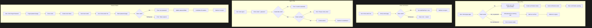

# Issue #17: Email/Password Authentication

**GitHub Issue:** [#17 - Add email/password authentication with account linking](https://github.com/rmonsurate/codewithfabric/issues/17)

## Summary

Add traditional email/password authentication alongside existing OAuth providers (Google, Apple, GitHub). Users who prioritize privacy can create accounts without using third-party OAuth.

## Architecture



## Key Features

| Feature | Description |
|---------|-------------|
| Email/Password Signup | Register with email and password |
| Email Verification | Required before account is active |
| Password Reset | Email-based reset flow |
| Account Linking | Same email across OAuth and password = one account |

## Database Changes

### New Fields on User Model

```prisma
model User {
  // ... existing fields
  passwordHash String?  // Nullable for OAuth-only users
}
```

### New Model: PasswordResetToken

```prisma
model PasswordResetToken {
  id        String   @id @default(cuid())
  token     String   @unique
  userId    String
  user      User     @relation(fields: [userId], references: [id], onDelete: Cascade)
  expiresAt DateTime
  createdAt DateTime @default(now())
}
```

## New Dependencies

- **bcryptjs** - Password hashing (pure JS, Edge runtime compatible)
- **resend** - Email delivery service

## API Routes

| Route | Method | Purpose |
|-------|--------|---------|
| `/api/auth/signup` | POST | Create account with email/password |
| `/api/auth/verify-email` | POST | Verify email with token |
| `/api/auth/forgot-password` | POST | Request password reset email |
| `/api/auth/reset-password` | POST | Reset password with token |
| `/api/auth/resend-verification` | POST | Resend verification email |

## New Pages

| Page | Purpose |
|------|---------|
| `/signup` | Registration form |
| `/verify-email` | Email verification status |
| `/forgot-password` | Request password reset |
| `/reset-password` | Set new password |

## Account Linking Strategy

1. **Signup with existing OAuth email**: Add password to existing account (auto-verified since OAuth verified email)
2. **OAuth with existing password email**: Handled by `allowDangerousEmailAccountLinking: true` (already configured)

## Security

| Measure | Value |
|---------|-------|
| Password Hash | bcrypt, cost factor 12 |
| Min Password Length | 8 characters |
| Token Generation | crypto.randomBytes (32 bytes) |
| Verification Token Expiry | 24 hours |
| Reset Token Expiry | 1 hour |
| Rate Limiting | Extended from existing implementation |
| Error Messages | Generic to prevent enumeration |

## Files to Modify

| File | Changes |
|------|---------|
| `prisma/schema.prisma` | Add passwordHash, PasswordResetToken |
| `src/lib/auth.ts` | Add CredentialsProvider |
| `src/app/signin/page.tsx` | Add email/password form |
| `src/middleware.ts` | Add new auth pages to public routes |

## Files to Create

| File | Purpose |
|------|---------|
| `src/lib/password.ts` | hashPassword, verifyPassword |
| `src/lib/email.ts` | Resend email service |
| `src/lib/tokens.ts` | Token generation & management |
| `src/app/api/auth/signup/route.ts` | Registration endpoint |
| `src/app/api/auth/verify-email/route.ts` | Verification endpoint |
| `src/app/api/auth/forgot-password/route.ts` | Request reset |
| `src/app/api/auth/reset-password/route.ts` | Reset password |
| `src/app/api/auth/resend-verification/route.ts` | Resend verification |
| `src/app/signup/page.tsx` | Registration page |
| `src/app/verify-email/page.tsx` | Verification page |
| `src/app/forgot-password/page.tsx` | Request reset page |
| `src/app/reset-password/page.tsx` | New password page |

## Implementation Order

1. Database schema changes + migration
2. Install dependencies (bcryptjs, resend)
3. Utility libraries (password, email, tokens)
4. API routes
5. CredentialsProvider in NextAuth
6. New pages
7. Update signin page
8. Middleware updates
9. Testing
